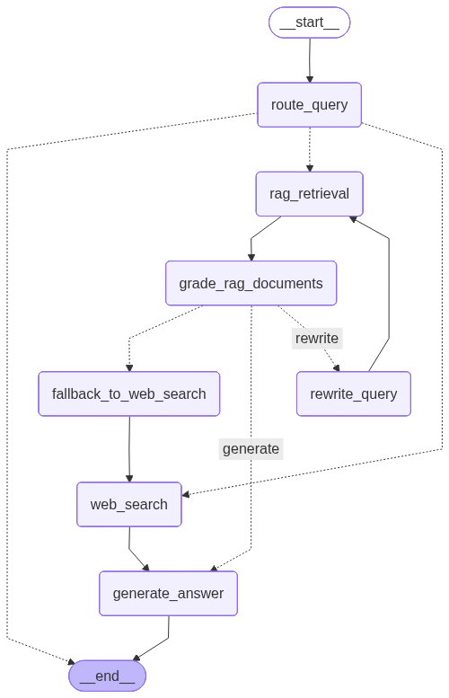

# AgenticRAG: Advanced Retrieval-Augmented Generation System

AgenticRAG is an advanced Retrieval-Augmented Generation (RAG) system built with LangGraph that implements multiple RAG approaches for reliable and accurate question answering. The system intelligently routes queries, retrieves relevant information, grades document relevance, and generates informed responses.

## Features

### Multi-Approach RAG Implementation

1. **Adaptive RAG**: Intelligently routes queries to the most appropriate processing path
2. **Corrective RAG**: Uses web search as a fallback when internal knowledge is insufficient
3. **Self-RAG**: Implements self-correction mechanisms to reduce hallucinations

### Intelligent Query Routing

The system automatically routes queries to one of three processing paths:
- **Direct Response**: For simple greetings or general knowledge questions
- **Vectorstore RAG**: For domain-specific questions with document relevance grading and query rewriting retries
- **Web Search**: As a fallback when internal RAG fails

### Advanced RAG Workflow

- Document relevance grading to ensure quality responses
- Query rewriting mechanism for improved retrieval on failed attempts
- Automatic fallback to web search after maximum RAG retries
- Stateful agent behavior with conversation history tracking

## Project Structure

```
AgenticRAG/
├── notebooks/
│   ├── AgenticRAG_1.ipynb        # Main RAG implementation
│   ├── DeepResearch_1.ipynb       # Deep research system
│   └── db/
│       └── faiss_ilianweng_db/   # Pre-built FAISS vector database
├── resources/
│   └── agenticrag_1.png          # System architecture diagram
└── README.md
```

## System Architecture

The Agentic RAG system follows a modular architecture with the following components:



## Prerequisites

- Python 3.8+
- Jupyter Notebook or JupyterLab
- Ollama with Qwen model (qwen3:8b)
- Serper API key for web search functionality

## Installation

1. Clone the repository:
   ```bash
   git clone <repository-url>
   cd AgenticRAG
   ```

2. Install required dependencies:
   ```bash
   pip install langchain langchain-community langchain-huggingface langgraph faiss-cpu requests
   ```

3. Install Ollama and pull the Qwen model:
   ```bash
   # Install Ollama from https://ollama.com/
   ollama pull qwen3:8b
   ```

4. Set up your Serper API key:
   ```bash
   export SERPER_API_KEY=your_serper_api_key_here
   ```

## Usage

### Main Agentic RAG System

Open and run `notebooks/AgenticRAG_1.ipynb` to use the main RAG system:

1. The notebook will automatically load a pre-built FAISS vector database containing content from Lilian Weng's blog posts on:
   - LLM Agents
   - Prompt Engineering
   - Adversarial Attacks on LLMs

2. Test the system with different types of queries:
   - Simple greetings (direct response)
   - Domain-specific questions (RAG pipeline)
   - Time-sensitive queries (web search fallback)

### Deep Research System

Open and run `notebooks/DeepResearch_1.ipynb` to use the deep research system:

1. This system performs comprehensive research on a query by:
   - Generating multiple search queries using an LLM planner
   - Searching each query on the web and summarizing results
   - Creating a comprehensive final report

## How It Works

### Query Routing

The system uses an LLM-based router to determine the best processing path for each query:
- Direct responses for simple greetings
- RAG pipeline for domain-specific questions
- Web search for time-sensitive information

### RAG Pipeline

1. **Document Retrieval**: Fetches relevant documents from the FAISS vector store
2. **Document Grading**: Assesses relevance of retrieved documents using an LLM
3. **Query Rewriting**: Improves queries when initial retrieval fails (up to 3 retries)
4. **Web Fallback**: Uses web search when RAG approaches fail after maximum retries
5. **Answer Generation**: Produces final responses based on available context

### Deep Research System

1. **Search Planning**: Generates multiple diverse search queries from the original query
2. **Web Search Execution**: Executes searches for each query and summarizes results
3. **Report Generation**: Creates a comprehensive report from all search summaries

## Customization

### Knowledge Base Management

The notebooks include code to rebuild the FAISS vector database from source documents. You can customize the knowledge base by:

1. Modifying the source URLs in the database creation section
2. Adjusting chunk size and overlap parameters
3. Changing the embedding model

### Model Configuration

You can customize the LLM by modifying the `ChatOpenAI` configuration:
- Change the model name
- Adjust temperature for creativity vs. consistency
- Modify other model parameters

## Contributing

Contributions are welcome! Please feel free to submit a Pull Request.

## License

This project is licensed under the MIT License - see the LICENSE file for details.

## Acknowledgments

- This implementation is based on concepts from the LangChain documentation and tutorials
- The knowledge base is built from Lilian Weng's blog posts on LLM topics
- Uses FAISS for efficient vector similarity search
- Integrates with Serper API for web search capabilities